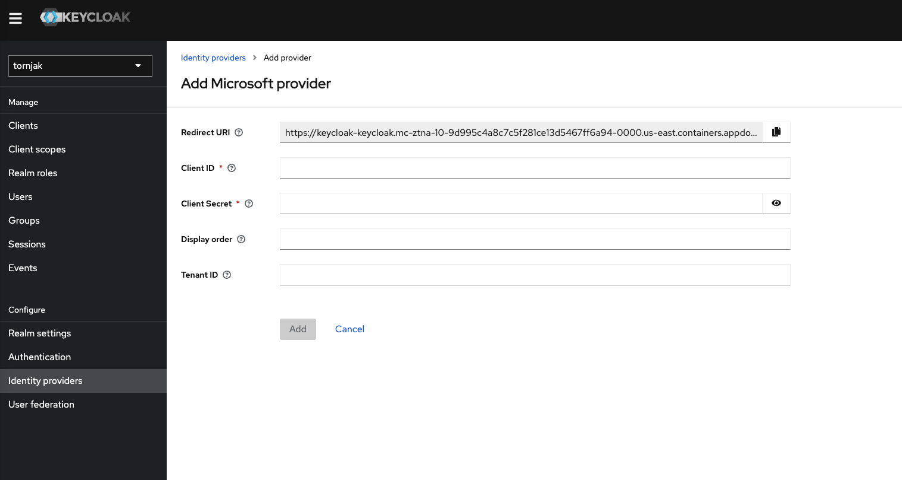
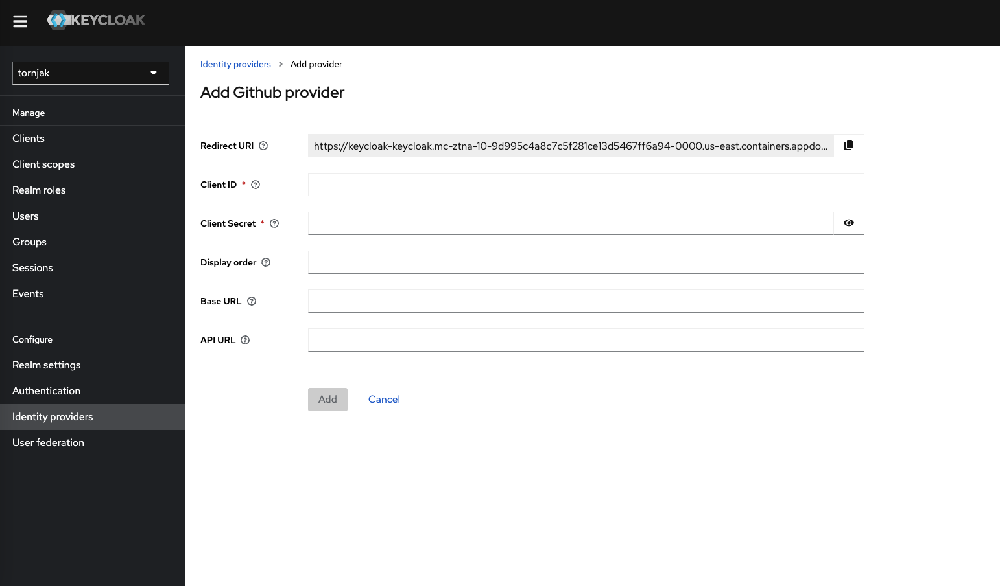
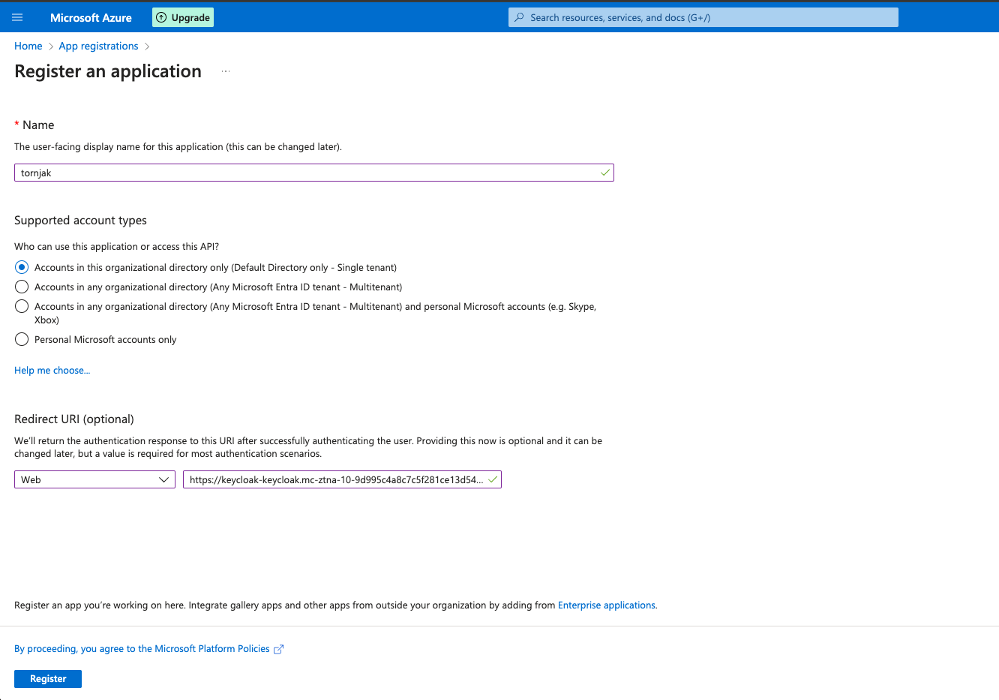
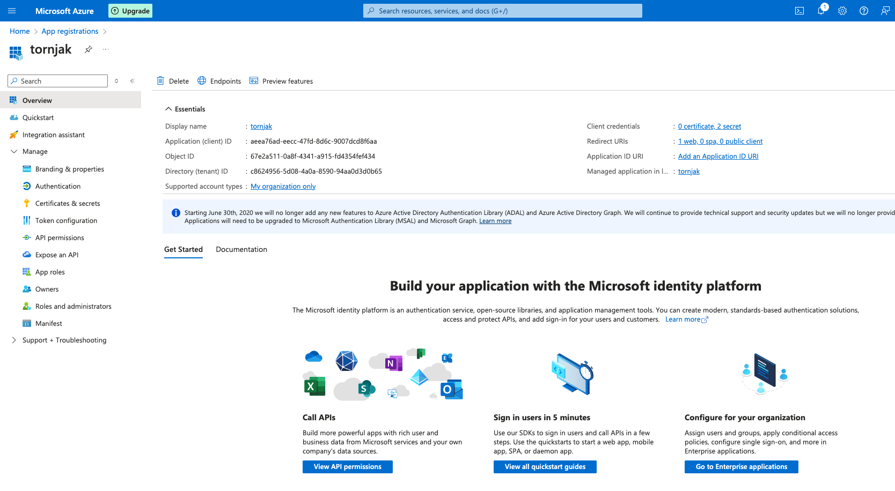
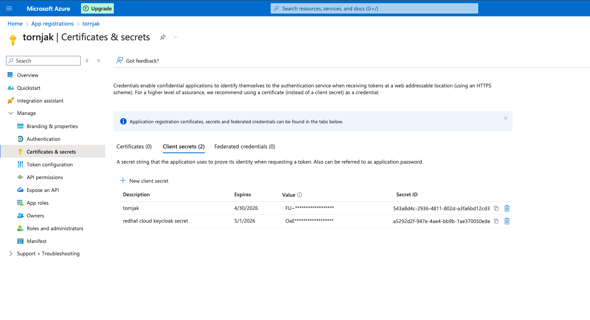
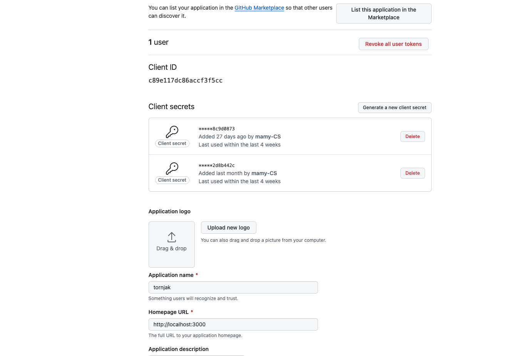
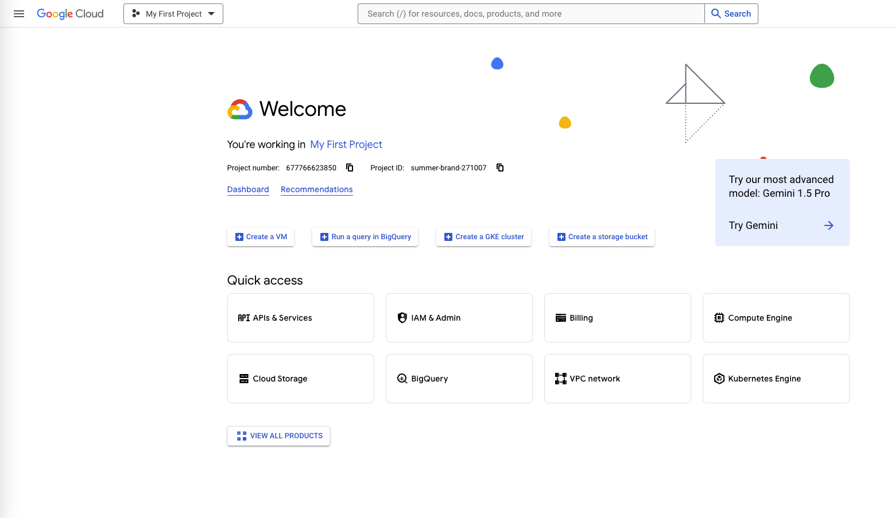
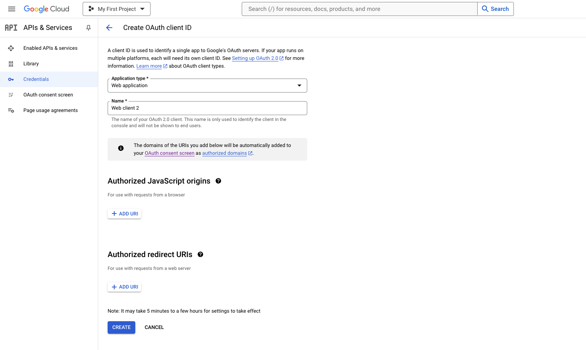
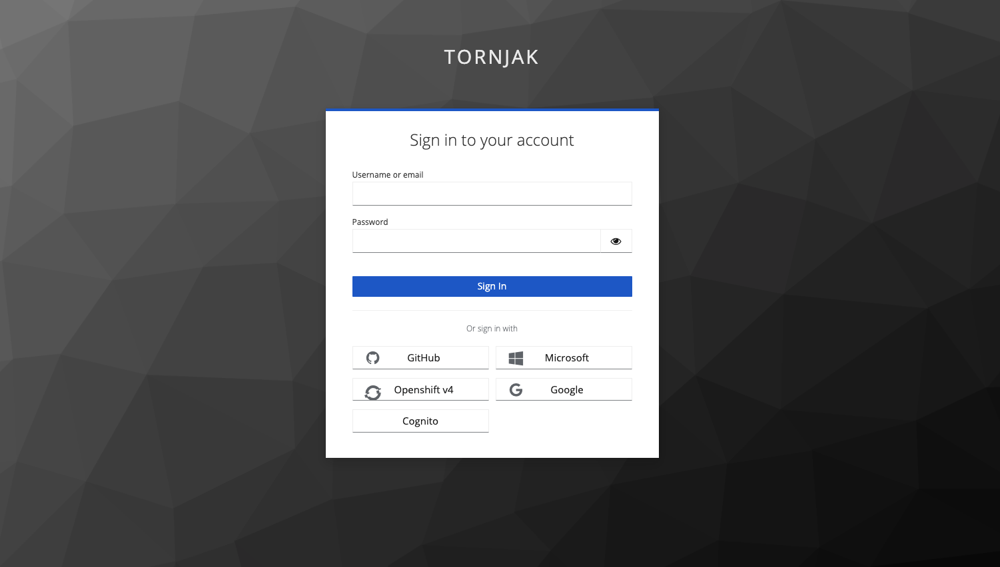

# Integrate Upstream Identity Providers to Keycloak

Keycloak has the ability to integrate with upstream identity providers. This way admins can use existing IAMs and /or users database pools while securing Tornjak. 

> [!NOTE]
> As long as your upstream IAM uses `OAuth v2.0`, `OpenID Connect v1.0` or `SAML v2.0` you can integrate your IAM to keycloak. 

This documentation is a guide on how to connect some hand picked IAMs. For more IAM connection options, go to your keycloak console and head to the `Identity providers` section. There you can see multple options including: 

- Another Keycloak OpenID service
- SAML
- Google
- Microsoft Azure - Active Directories (AD)
- Openshift v3 and v4
- Github
- etc...

### Keycloak setup for Upstream IAMs
The keycloak setup to connect any upstream IAM is pretty much standard. Please follow the steps below to connect your upsteeam IAM of choice. Go to keycloak console and select the IAM of interest as shown in the picture above. 

> [!IMPORTANT] 
> Make sure you are in the `tornjak` realm or the specific realm Tornjak app is registered on 
- The `Redirect URI` is automatically set by keycloak, this is the uri you should enter in the `Redirect URI` section while creating/ updating your upstream IAM account (check below for specific upstream IAM instuctions). 
- Fill in the `Client ID` and `Client Secret` generated in the upstream IAM in the respective fields. [Go to your upstream IAM account to get the `Client ID` and `Client Secret`]
- For `Microsoft Azure`single-tenant auth endpoints, fill in the `Tenant ID`. If not specified uses 'common' multi-tenant endpoints. 
- And click `Add`

> [!IMPORTANT] Make sure you assign appropraite roles within keycloak for your user, or the roles are mapped correctly between the upstream IAM and keycloak. Check the Mappers section for more roles configuration. [****DETAILED MAPPERS SECTION TODO!!!****]

> Now when you try signing in to the Tornjak application, you should see the keycloak login page and the upstream IAM as an optional upstream identity provider to sign in to. If you select the upstream IAM, keycloak will redirect you to sign in with the upstream IAM of choice and tornjak will be authenticated using that IAM. 

### Microsoft

### Github

### Google

<b> Setup Microsoft Azure Active Directories (AD) as an Upstream Identity Provider </b>

If you don't have an AD account, follow the instructions below to create one. 

> [!NOTE] 
> For simplicity we will be creating a free account

- Go to Microsoft Azure portal for your account. 
- Go to `App registrations` (you can search for it on top)
- Click on `New Registration`
- Configure the name, kepp the default `Single tenant`directory and add a `Redirect URI` by selecting `Web` and paste the value of `Redirect URI` from keycloak and Register the application. 

- Note the `Applcation (client) ID`, this is what you use to enter in the `Client ID` field while configuring the IAM on keycloak. 
- Note the `Directory (tenant) ID`, this is what you will use to enter in the `Tenant ID` field while configuring the IAM on keycloak. 

- On the left hand side go to Manage > Certificates & secrets and click on `New client secret`, give it a description and choose the expiry length ad click `Add` at the bottom. Note the `Value` of the created secret. This secret is what you will be using as the `Client Secret` to configure the IAM on keycloak. 

<b> Setup Github as an Upstream Identity Provider </b>

If you don't have a Github OAUTH app, follow the instructions below to create one. 

> [!NOTE] 
> For simplicity we will be creating an OAUTH app under a personal github account. But you can create one under an organization you have admin access to. Github uses OAuth 2.0.
- In your personal github account, go to the upper-right corner of your github account and click on your profile photo and then click on settings. 
- At the bottom of the menu on the left hand side, select `<> Developer settings`
- On the next page, select `OAuth Apps` on the left-hand side menu
- Select `New OAuth App` or keep a note of your existing OAuth App if any. 
- Give your app a name in the `Application name` field such as `tornjak`, your application Homepage URL (http://localhost:3000) and the `Authorization callback URL` should be set to the `Redirect URI` assigned by keycloak. 
- And register your application. 

- Once the application is registered click on `Generate a new client secret` and keep a note of the `Client ID` and the `Client Secret` generated. This is what you will use to configure upstream IAM on keycloak. 

<b> Setup Google as an Upstream Identity Provider </b>

If you don't have a Google account, follow the instrctions below to create one. 

> [!NOTE] 
> For simplicity we will be creating an OAUTH app under a personal google account.
- Go to Google Cloud Platform console: https://console.cloud.google.com

- Go to `APIs & Services` -> `OAuth consent screen` tab on left hand side and select `External` user type consent screen to create a new consent screen. 
- After creating the consent screen, go to `Credentials` tab on left hand side, click on `CREATE CREDENTIALS` and select `OAuth Client ID`. For `Application type` select `Web application`. Give it a client name, for `Authorized redirect URIs` use the Redirect URI in your keycloak console. 
- Once you click create note your `Client id` and `Client secret`. This is what you will use to configure upstream IAM on keycloak. 

<b> Setup Openshift as an Upstream Identity Provider </b>

If you don't have an Openshift account, follow the instrctions below to create one. 

****DOCUMENTATION FOR OPENSHIFT TO BE ADDED!!!****

- As you add an upstream IAM, you will see an option to sign in with the IAM in the keycloak login page as shown on the picture below. 

> [!TIP] To make an upstream identity provider default: in another words for keycloak to directly redirect to the choosen identity provider, instead of showing the default keycloak login page follow the following steps below:
- Click on `Authentication` on the left handside menu
- Choose the `browser` flow

- Click on the gear icon on the `Identity Provider Redirector` and set to the alias of the identity provider you want keycloak to redirect to. 