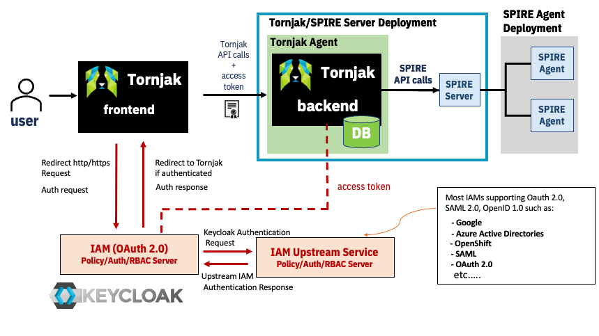
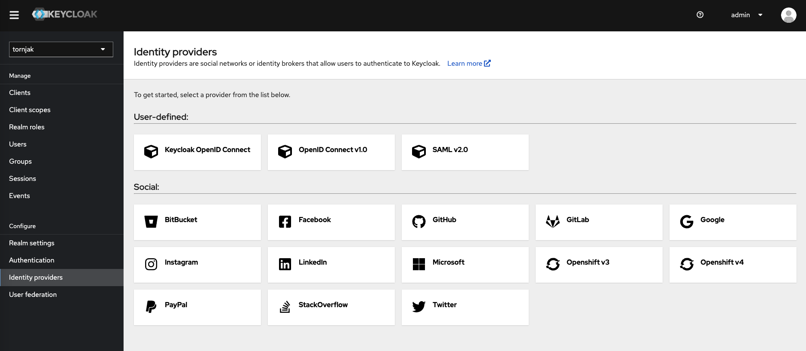
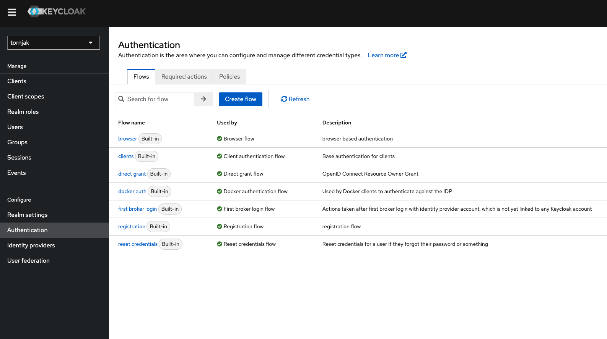

# Integrate Upstream Identity Providers to Keycloak

Keycloak has the ability to integrate with upstream identity providers. This way users/ admins can use their existing IAMs and /or users database pool while securing Tornjak. 

> [!NOTE]
> As long as your upstream IAM uses `OAuth v2.0`, `OpenID Connect v1.0` or `SAML v2.0` you can integarte your IAM to keycloak. 

This documentation is a guide on how to connect some hand picked IAMs. For more IAM connection options, go to your keycloak console and head to the `Identity providers` section. There you can see multple options including: 

- Another Keycloak OpenID service
- SAML
- Google
- Microsoft Azure - Active Directories (AD)
- Openshift v3 and v4
- Github
- etc...

## Setup Microsoft Azure Active Directories (AD) as an Upstream Identity Provider
If you don't have an AD account, follow the instrctions below to create one. 

## Setup Github as an Upstream Identity Provider
If you don't have a Github OAUTH app, follow the instrctions below to create one. 
> [!NOTE] For simplicity we will be creating an OAUTH app under a personal github account. But you can create one under an organization you have admin access to. Github uses OAuth 2.0.
- Go to the upper-right corner of your github account and click on your profile photo and then click on settings. 
- At the bottom of the menu on the left hand side, select `<> Developer settings`
- On the next page, select `OAuth Apps` on the left-hand side menu
- Select `New OAuth App` or keep a note of your existing OAuth App if any. 
- Give your app a name in the `Application name` field such as `tornjak`, your application Homepage URL (http://localhost:3000) and the `Authorization callback URL` should be set to the `Redirect URI` on keycloak. 
- And register your application. 

- Once the application is registered click on `Generate a new client secret` and keep a note of the `Client ID` and the `Client Secret` generated. 

### Keycloak Github setup 
Go back to keycloak console and select Github as an identity provider. 
> [!IMPORTANT] Make sure you are in the `tornjak` realm or te specific realm Tornjak app is registered on 
- The `Redirect URI` is automatically set by keycloak, this is the uri you should enter in the `Authorization callback URL` while creating your github OAuth app above. 
- Copy ad paste the `Client ID` and `Client Secret` you generated in the github OAuth app from above in the respective fields. 
- And click `Add`
- Now when you try signing in to the Tornjak application, you should see the keycloak login page and github as an optional upstream identity provider to sign in to. If you sleect github, keycloak will redirect you to sign in with github login and tornjak will be authenticated using github OAuth. 
> [!IMPORTANT] Make sure you assign appropraite roles within keycloak for your user, or the roles are mapped correctly between github and keycloak. 

## Setup Openshift as an Upstream Identity Provider
If you don't have an Openshift account, follow the instrctions below to create one. 

## Setup Google as an Upstream Identity Provider
If you don't have a Google account, follow the instrctions below to create one. 

> [!TIP] To make an upstream identity provider default: in another words for keycloak to directly redirect to the choosen identity provider, instead of showing the default keycloak login page follow the following steps below:
- Click on `Authentication` on the left handside menu
- Choose the `browser` flow

- Click on the gear icon on the `Identity Provider Redirector` and set to the alias of the identity provider you want keycloak to redirect to. 