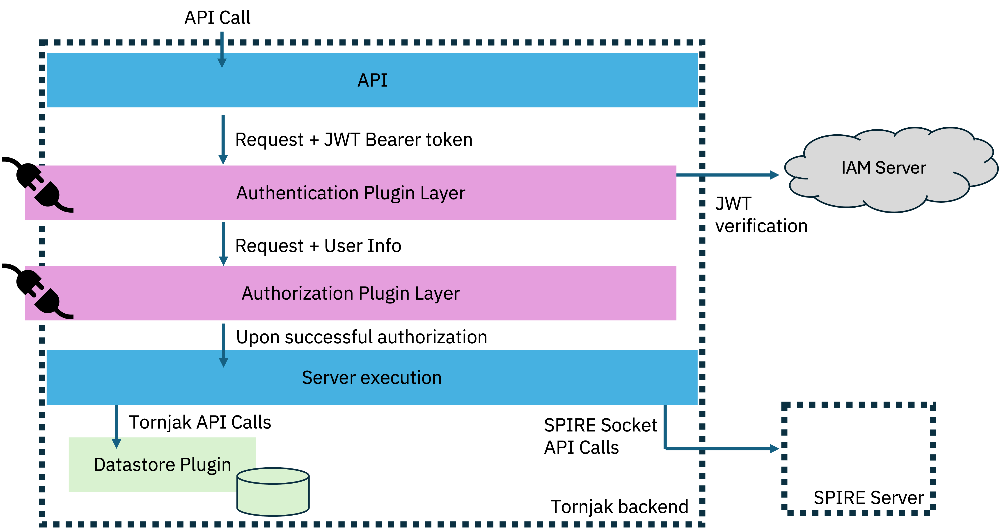

# Tornjak Server Configuration Reference

This document is a reference for the Tornjak server, and it follows the [SPIRE server config](https://github.com/spiffe/spire/blob/main/doc/spire_server.md). It includes information about plugin types, built-in plugins, the server configuration file, plugin configuration, and command line options for `tornjak-agent` commands.

## Contents

- [Command line options](#command-line-options)
- [The Tornjak Config](#the-tornjak-config)
- [General Tornjak Server Configs](#general-tornjak-server-configs)
- [About Tornjak Plugins](#about-tornjak-plugins)
- [Sample Configuration Files](#sample-configuration-files)
- [Further Reading](#further-reading)

## Command line options

The following flags are available for all tornjak-agent commands:

| Command                | Action                             | Default | Required |
|:-----------------------|:-----------------------------------|:--------| :--------|
| `--spire-config`       | Config file path for SPIRE server  |         | false    |
| `--tornjak-config`     | Config file path for Tornjak agent |         | true     |
| `--expandEnv`          | If flag included, expand environment variables in Tornjak config | false   | false    |

Note these flags are passed in directly through the Tornjak container.

### `tornjak-backend serverinfo`

Prints the SPIRE config and Tornjak config given.

### `tornjak-backend http`

Runs the tornjak server.

## The Tornjak Config

The Tornjak config that is passed in must follow a specific format. Examples of this format can be found [below](#sample-configuration-files). In general, it is split into the `server` section with [general Tornjak server configs](#general-tornjak-server-configs), and the `plugins` section.

## General Tornjak Server Configs

The server config will contain information for the two potential connections: HTTP and HTTPS. HTTPS can be configured to follow TLS or mTLS protocol. See below for sample configuration:

```hcl
server {

    spire_socket_path = "unix:///tmp/spire-server/private/api.sock" # socket to communicate with SPIRE server

    http { # required block
     port = 10000 # if HTTP enabled, opens HTTP listen port at container port 10000
    }

    https { # optional, recommended block
        port = 10443 # if enabled, opens HTTPS listen port at container port 10443
        cert = "sample-keys/tls.pem" # path of certificate for TLS
        key = "sample-keys/key.pem" # path of keys for TLS
        client_ca = "sample-keys/userCA.pem" # [optional, enables mTLS] User CA 
    }

}
```

We have two connection types that are opened by the server simultaneously: HTTP and HTTPS. HTTP is always operational.  The optional HTTPS connection is recommended for production use case.  When HTTPS is configured, the HTTP connection will redirect to the HTTPS (port and service).

Under the HTTPS block, the fields `port`, `cert`, and `key` are required to enable TLS connection.  To enable the mutual TLS (mTLS), you must additionally include the `client_ca` field, so the verification can be done bi-directionally.

For examples on enabling TLS and mTLS connections, please see [our TLS and mTLS documentation](../sample-keys/README.md).

## About Tornjak plugins

Tornjak supports several different plugin types, each representing a different functionality. The diagram below shows how each of the plugin types fit into the backend:



### Plugin types

| Type            | Description | Required |
|:----------------|:------------|:---------|
| DataStore       | Provides persistent storage for Tornjak metadata. | True |
| SPIRECRDManager | Enables SPIRE CRD Management via Tornjak API. | False |
| Authenticator   | Verify tokens signed by external OIDC server and extract user information to be passed to the Authorization layer. Any user information or errors from this layer are to be interpreted by an Authorizer layer. | False |
| Authorizer      | Based on user information or errors passed from authentication layer and API call details, apply authorization logic. | False |

### Built-in plugins

| Type | Name | Description |
| ---- | ---- | ----------- |
| DataStore       | ["SQL"](/docs/plugins/plugin_server_datastore_sql.md) | Default SQL storage for Tornjak metadata |
| SPIRECRDManager | ["SpireCRD"](/docs/plugins/plugin_server_spirecrd.md) | CRD Manager |
| Authenticator   | [keycloak](/docs/plugins/plugin_server_authentication_keycloak.md) | Perform OIDC Discovery and extract roles from `realmAccess.roles` field |
| Authorizer      | [RBAC](/docs/plugins/plugin_server_authorization_rbac.md) | Check api permission based on user role and defined authorization logic |

### Plugin configuration

The server configuration file also contains a configuration section for the various SPIRE server plugins. Plugin configurations live inside the top-level `plugins { ... }` section, which has the following format:

```hcl
plugins {
    pluginType "pluginName" {
        ...
        plugin configuration options here
        ...
    }
}
```

The following configuration options are available to configure a plugin:

| Configuration   | Description                              |
| --------------- | ---------------------------------------- |
| plugin_data     | Plugin-specific data                     |

## Sample configuration files

The most basic configuration file can be found [here](./conf/agent/base.conf).

We have an extended configuration file with comments on each section found [here](./conf/agent/full.conf).

## Further reading

- [Tornjak Agent Architecture Overview](https://github.com/spiffe/tornjak/blob/main/docs/tornjak-agent.md)
- [Tornjak API Documentation](https://github.com/spiffe/tornjak/blob/main/docs/tornjak-ui-api-documentation.md)
