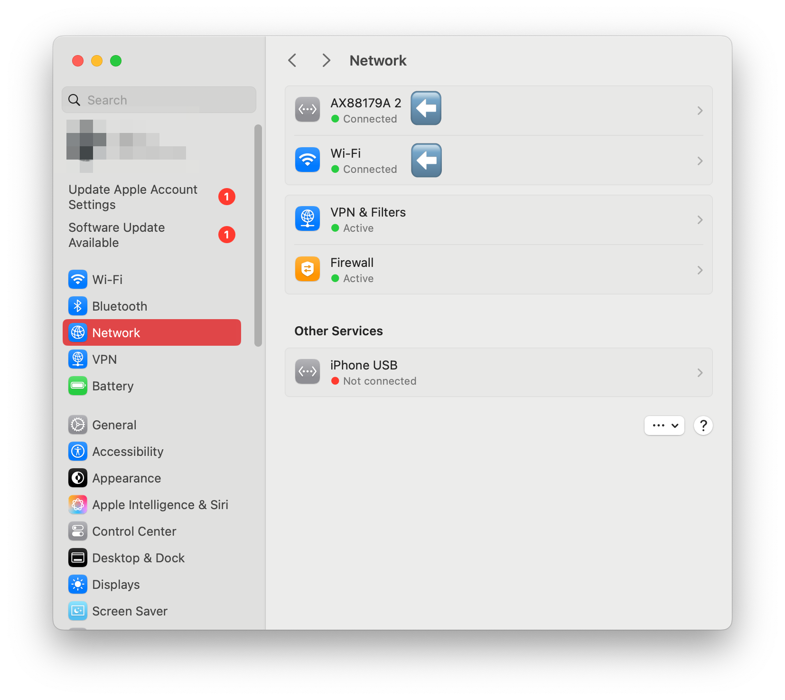
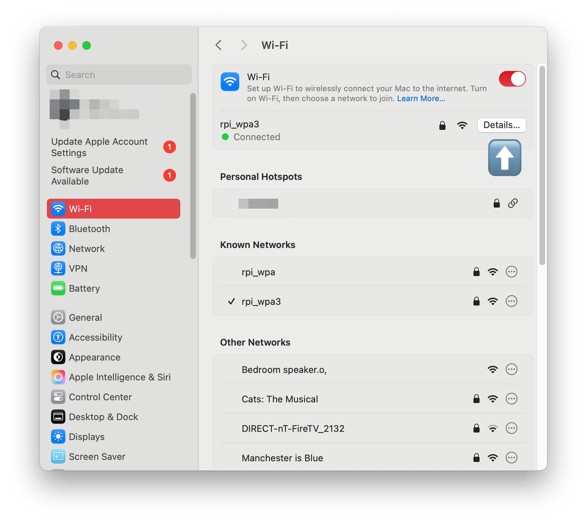
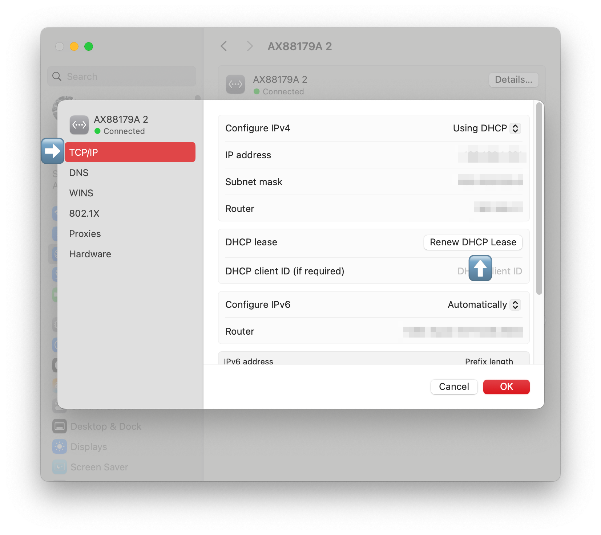

# Tornjak simple deployment with SPIRE k8s quickstart

In this tutorial, we will show how to configure Tornjak with a SPIRE deployment using the SPIRE k8s quickstart tutorial. This is heavily inspired by the [SPIRE quickstart for Kubernetes](https://spiffe.io/docs/latest/try/getting-started-k8s/).

Before we dive into the deployment process, let’s familiarize ourselves with Tornjak and SPIRE.

[SPIRE](https://github.com/spiffe/spire) (the SPIFFE Runtime Environment) is an open-source software tool that provides a way to issue and manage identities in the form of SPIFFE IDs within a distributed system. These identities are used to establish trust between software services and are based on the SPIFFE (Secure Production Identity Framework For Everyone) standards, which define a universal identity control plane for distributed systems. SPIRE provides access to the SPIFFE Workload API, which authenticates active software systems and allocates SPIFFE IDs and corresponding SVIDs to them. This process enables mutual trust establishment between two distinct workloads.

Tornjak is a control plane and GUI for SPIRE, aimed at managing SPIRE deployments across multiple clusters. It provides a management plane that simplifies and centralizes the administration of SPIRE, offering an intuitive interface for defining, distributing, and visualizing SPIFFE identities across a heterogeneous environment.

This tutorial will get you up and running with a local deployment of SPIRE and Tornjak in three simple steps:
- Setting up the deployment files
- Deployment
- Connecting to Tornjak.

Contents
- [Step 0: Prerequisite](#step-0-prerequisite)
- [Step 1: Setup Deployment files](#step-1-setup-deployment-files)
- [Step 2: Deployment of SPIRE and co-located Tornjak](#step-2-deployment-of-spire-and-co-located-tornjak)
- [Step 3: Configuring Access to Tornjak](#step-3-configuring-access-to-tornjak)
- [Cleanup](#cleanup)
- [Troubleshooting Commmon Issues](#Troubleshooting)

## Step 0: Prerequisite

Before you begin this tutorial, make sure you have the following:
- Minikube: Version 1.12.0 or later. [Download Minikube.](https://minikube.sigs.k8s.io/docs/start/)
- Docker: Version 20.10.23 or later. [Install Docker.](https://docs.docker.com/get-docker/)

Note: While we have tested this tutorial with the versions below, newer versions should also work. Ensure you're using the most recent stable releases to avoid compatibility issues.
 - Minikube Version 1.12.0, Version 1.31.2
 - Docker Version 20.10.23, Version 24.0.6

[Troubleshoot 5: Docker detected as malware](#troubleshooting)

## Step 1: Setup deployment files

### Setting up k8s

For this tutorial, we will use minikube. If you have an existing kubernetes cluster, feel free to use that.

```sh
minikube start
```

- By default, Minikube automatically selects the best available driver. If you want to explicitly run Minikube on Docker, use the following command:
  ```sh
  minikube start --driver=docker
  ```


```
😄  minikube v1.12.0 on Darwin 11.2
🎉  minikube 1.18.1 is available! Download it: https://github.com/kubernetes/minikube/releases/tag/v1.18.1
💡  To disable this notice, run: 'minikube config set WantUpdateNotification false'
✨  Automatically selected the docker driver. Other choices: hyperkit, virtualbox
👍  Starting control plane node minikube in cluster minikube
🔥  Creating docker container (CPUs=2, Memory=1989MB) ...
🐳  Preparing Kubernetes v1.18.3 on Docker 19.03.2 ...
🔎  Verifying Kubernetes components...
🌟  Enabled addons: default-storageclass, storage-provisioner
🏄  Done! kubectl is now configured to use "minikube"
```

```sh
kubectl get nodes
```

```
NAME       STATUS   ROLES    AGE   VERSION
minikube   Ready    master   79s   v1.18.3
```

[Troubleshoot 1: Minikube fails to start with a Docker CLI context error](#troubleshooting)

[Troubleshoot 4: Right kubectl missing...](#troubleshooting)
### Obtaining the Deployment Files

To obtain the relevant files, clone our git repository and cd into the correct directory:

```sh
git clone https://github.com/spiffe/tornjak.git
cd tornjak
cd docs/quickstart
```

Notice, the files in this directory are largely the same files as provided by the [SPIRE quickstart for Kubernetes](https://spiffe.io/docs/latest/try/getting-started-k8s/). However, there are some minor key differences. Take note of the tornjak-configmap.yaml file, which includes configuration details for the Tornjak backend.
To view the configuration you can issue the following:

```sh
cat tornjak-configmap.yaml
```

Contents of the configuration for the Tornjak backend should look like:

```
apiVersion: v1
kind: ConfigMap
metadata:
  name: tornjak-agent
  namespace: spire
data:
  server.conf: |

    server {
      # location of SPIRE socket
      # here, set to default SPIRE socket path
      spire_socket_path = "unix:///tmp/spire-server/private/api.sock"

      # configure HTTP connection to Tornjak server
      http {
        port = 10000 # opens at port 10000
      }

    }

    plugins {
      DataStore "sql" { # local database plugin
        plugin_data {
          drivername = "sqlite3"
          filename = "/run/spire/data/tornjak.sqlite3" # stores locally in this file
        }
      }
    }
```

More information on this config file format can be found in [our config documentation](../config-tornjak-server.md).

Additionally, we have sample server-statefulset files in the directory `server-statefulset-examples`. We will copy one of them in depending on which deployment scheme you would like.

### Choosing the Statefulset Deployment

Depending on your use case, you can deploy Tornjak in different configurations. Note we have deprecated support of the use case where parts of Tornjak run on the same container as SPIRE.

Currently, we support the following deployment scheme:

1. Only the Tornjak backend (to make Tornjak API calls)  is run as a separate container on the same pod that exposes only one port (to communicate with the Tornjak backend). This deployment type is fully-supported, has a smaller sidecar image without the frontend components, and ensures that the frontend and backend share no memory.

Using the option below, easily copy in the right server-statefulset file.

<details open><summary><b> 🔴 [Click] For the deployment of only the Tornjak backend (API) (Necessary for this quickstart)</b></summary>

There is an additional requirement to mount the SPIRE server socket and make it accessible to the Tornjak backend container.

The relevant file is called `backend-sidecar-server-statefulset.yaml` within the examples directory.  Please copy to the relevant file as follows:

```sh
cp server-statefulset-examples/backend-sidecar-server-statefulset.yaml server-statefulset.yaml
```

The statefulset will look something like this, where we have commented leading with a 👈 on the changed or new lines:

```sh
cat server-statefulset.yaml
```

```
apiVersion: apps/v1
kind: StatefulSet
metadata:
  name: spire-server
  namespace: spire
  labels:
    app: spire-server
spec:
  replicas: 1
  selector:
    matchLabels:
      app: spire-server
  serviceName: spire-server
  template:
    metadata:
      namespace: spire
      labels:
        app: spire-server
    spec:
      serviceAccountName: spire-server
      containers:
        - name: spire-server
          image: ghcr.io/spiffe/spire-server:1.10.4
          args:
            - -config
            - /run/spire/config/server.conf
          ports:
            - containerPort: 8081
          volumeMounts:
            - name: spire-config
              mountPath: /run/spire/config
              readOnly: true
            - name: spire-data
              mountPath: /run/spire/data
              readOnly: false
            - name: socket                         # 👈 ADDITIONAL VOLUME
              mountPath: /tmp/spire-server/private # 👈 ADDITIONAL VOLUME
          livenessProbe:
            httpGet:
              path: /live
              port: 8080
            failureThreshold: 2
            initialDelaySeconds: 15
            periodSeconds: 60
            timeoutSeconds: 3
          readinessProbe:
            httpGet:
              path: /ready
              port: 8080
            initialDelaySeconds: 5
            periodSeconds: 5
        ### 👈 BEGIN ADDITIONAL CONTAINER ###
        - name: tornjak-backend
          image: ghcr.io/spiffe/tornjak-backend:2.0.0
          args:
            - --config
            - /run/spire/config/server.conf
            - --tornjak-config
            - /run/spire/tornjak-config/server.conf
          ports:
            - containerPort: 8081
          volumeMounts:
            - name: spire-config
              mountPath: /run/spire/config
              readOnly: true
            - name: tornjak-config
              mountPath: /run/spire/tornjak-config
              readOnly: true
            - name: spire-data
              mountPath: /run/spire/data
              readOnly: false
            - name: socket
              mountPath: /tmp/spire-server/private
        ### 👈 END ADDITIONAL CONTAINER ###
      volumes:
        - name: spire-config
          configMap:
            name: spire-server
        - name: tornjak-config  # 👈 ADDITIONAL VOLUME
          configMap:            # 👈 ADDITIONAL VOLUME
            name: tornjak-agent # 👈 ADDITIONAL VOLUME
        - name: socket          # 👈 ADDITIONAL VOLUME
          emptyDir: {}          # 👈 ADDITIONAL VOLUME
  volumeClaimTemplates:
    - metadata:
        name: spire-data
        namespace: spire
      spec:
        accessModes:
          - ReadWriteOnce
        resources:
          requests:
            storage: 1Gi
```

Note that there are three key differences in this StatefulSet file from that in the SPIRE quickstart:

1. There is a new container in the pod named tornjak-backend.
3. We create a volume named `tornjak-config` that reads from the ConfigMap `tornjak-agent`.
4. We create a volume named `test-socket` so that the containers may communicate.

This is all done specifically to pass the Tornjak config file as an argument to the container and to allow communication between Tornjak and SPIRE.

</details>

## Step 2: Deployment of SPIRE and co-located Tornjak

Now that we have the correct deployment files, please follow the below steps to deploy Tornjak and SPIRE!

NOTE: In a Windows OS environment, you will need to replace the backslashes ( \\ ) below with backticks ( \` ) to copy and paste into a Windows terminal. This doesnt apply for MacOS.

```sh
kubectl apply -f spire-namespace.yaml \
    -f server-account.yaml \
    -f spire-bundle-configmap.yaml \
    -f tornjak-configmap.yaml \
    -f server-cluster-role.yaml \
    -f server-configmap.yaml \
    -f server-statefulset.yaml \
    -f server-service.yaml
```

The above command should deploy the SPIRE server with Tornjak:

```
namespace/spire created
serviceaccount/spire-server created
configmap/spire-bundle created
configmap/tornjak-agent created
role.rbac.authorization.k8s.io/spire-server-configmap-role created
rolebinding.rbac.authorization.k8s.io/spire-server-configmap-role-binding created
clusterrole.rbac.authorization.k8s.io/spire-server-trust-role created
clusterrolebinding.rbac.authorization.k8s.io/spire-server-trust-role-binding created
configmap/spire-server created
statefulset.apps/spire-server created
service/spire-server created
service/tornjak-backend-http created
service/tornjak-backend-tls created
service/tornjak-backend-mtls created
service/tornjak-frontend created
```

Before continuing, check that the spire-server is ready:

```sh
kubectl get statefulset --namespace spire
```

```
NAME           READY   AGE
spire-server   1/1     26s
```

NOTE: You may initially see a `0/1` for READY status. Just wait a few minutes and then try again

### Deploying the agent and creating test entries

The following steps will configure and deploy the SPIRE agent.
NOTE: In a windows environment, you will need to replace the backslashes ( \\ ) below with backticks ( \` ) to copy and paste into a windows terminal

```sh
kubectl apply \
    -f agent-account.yaml \
    -f agent-cluster-role.yaml \
    -f agent-configmap.yaml \
    -f agent-daemonset.yaml
```

```
serviceaccount/spire-agent created
clusterrole.rbac.authorization.k8s.io/spire-agent-cluster-role created
clusterrolebinding.rbac.authorization.k8s.io/spire-agent-cluster-role-binding created
configmap/spire-agent created
daemonset.apps/spire-agent created
```

```sh
kubectl get daemonset --namespace spire
```

```
NAME          DESIRED   CURRENT   READY   UP-TO-DATE   AVAILABLE   NODE SELECTOR   AGE
spire-agent   1         1         1       1            1           <none>          19s

```
- Similar as above, if you see any of the field that is showing 0 instead of 1, try to re-run the command after a minute or so.

Then, we can create a registration entry for the node.

NOTE: In a windows environment, you will need to replace the backslashes ( \\ ) below with backticks ( \` ) to copy and paste into a windows terminal

```sh
kubectl exec -n spire -c spire-server spire-server-0 -- \
    /opt/spire/bin/spire-server entry create \
    -spiffeID spiffe://example.org/ns/spire/sa/spire-agent \
    -selector k8s_psat:cluster:demo-cluster \
    -selector k8s_psat:agent_ns:spire \
    -selector k8s_psat:agent_sa:spire-agent \
    -node
```

```
Entry ID         : 644d374c-97c9-4072-a173-aca01fbfd400
SPIFFE ID        : spiffe://example.org/ns/spire/sa/spire-agent
Parent ID        : spiffe://example.org/spire/server
Revision         : 0
TTL              : default
Selector         : k8s_psat:agent_ns:spire
Selector         : k8s_psat:agent_sa:spire-agent
Selector         : k8s_psat:cluster:demo-cluster
```

And we create a registration entry for the workload registrar, specifying the workload registrar's SPIFFE ID:

NOTE: In a windows environment, you will need to replace the backslashes ( \\ ) below with backticks ( \` ) to copy and paste into a windows terminal
```sh
kubectl exec -n spire -c spire-server spire-server-0 -- \
    /opt/spire/bin/spire-server entry create \
    -spiffeID spiffe://example.org/ns/default/sa/default \
    -parentID spiffe://example.org/ns/spire/sa/spire-agent \
    -selector k8s:ns:default \
    -selector k8s:sa:default
```

```
Entry ID         : e9e46b6f-2ffd-4a31-8995-964e979b9929
SPIFFE ID        : spiffe://example.org/ns/default/sa/default
Parent ID        : spiffe://example.org/ns/spire/sa/spire-agent
Revision         : 0
X509-SVID TTL    : default
JWT-SVID TTL     : default
Selector         : k8s:ns:default
Selector         : k8s:sa:default
```

Finally, here we deploy a workload container:

```sh
kubectl apply -f client-deployment.yaml
```

```
deployment.apps/client created
```

And also verify that the container can access the workload API UNIX domain socket:

```sh
kubectl exec -it $(kubectl get pods -o=jsonpath='{.items[0].metadata.name}' \
   -l app=client)  -- /opt/spire/bin/spire-agent api fetch -socketPath /run/spire/sockets/agent.sock
```

```
Received 1 svid after 3.224079ms

SPIFFE ID:              spiffe://example.org/ns/default/sa/default
SVID Valid After:       2025-05-13 02:14:17 +0000 UTC
SVID Valid Until:       2025-05-13 03:14:27 +0000 UTC
CA #1 Valid After:      2025-05-13 02:12:35 +0000 UTC
CA #1 Valid Until:      2025-05-14 02:12:45 +0000 UTC
```

Let's verify that the `spire-server-0` pod is now started with the new image:

```sh
kubectl -n spire describe pod spire-server-0 | grep "Image:"
```

**or**, on Windows:
```sh
kubectl -n spire describe pod spire-server-0 | select-string "Image:"
```

Should yield two lines depending on which deployment you used:

```
    Image:         ghcr.io/spiffe/spire-server:1.10.4
    Image:         <TORNJAK-IMAGE>
```

where `<TORNJAK-IMAGE>` is `ghcr.io/spiffe/tornjak:latest` if you deployed the Tornjak with the UI and is `ghcr.io/spiffe/tornjak-backend:latest` if you deployed only the Tornjak backend.

## Step 3: Configuring Access to Tornjak

### Step 3a: Connecting to the Tornjak backend to make Tornjak API calls

The Tornjak HTTP server is running on port 10000 on the pod. This can easily be accessed by performing a local port forward using `kubectl`. This will cause the local port 10000 to proxy to the Tornjak HTTP server.

```sh
kubectl -n spire port-forward spire-server-0 10000:10000
```
💡 Tip: For the following steps to work, run the above command in a new terminal window or tab, depending on your setup.

You'll see something like this:

```
Forwarding from 127.0.0.1:10000 -> 10000
Forwarding from [::1]:10000 -> 10000
```

While this runs, open a browser to

```
http://localhost:10000/api/v1/tornjak/serverinfo
```

This output represents the backend response. Now you should be able to make Tornjak API calls! (you may want to open in Firefox to load the following style correctly)


### Step 3b: Connecting to the Tornjak frontend to access the Tornjak UI

Make sure that the backend is accessible from your browser at `http://localhost:10000`, as above, or the frontend will not work.

If you chose to deploy Tornjak with the UI, connecting to the UI is very simple. Otherwise, you can always run the UI locally and connect. See the two choices below:

<details open><summary><b> 🔴 [Click] Run the Tornjak frontend locally</b></summary>

You will need to deploy the separate frontend separately to access the exposed Tornjak backend. We have prebuilt the frontend in a container, so we can simply run it via a single docker command in a separate terminal, which will take a couple minutes to run:

```sh
docker run -p 3000:3000 -e REACT_APP_API_SERVER_URI='http://localhost:10000' ghcr.io/spiffe/tornjak-frontend:v2.0.0
```

After the image is downloaded, you will eventually see the following output:

```
> tornjak-frontend@0.1.0 start
> react-scripts --openssl-legacy-provider start

ℹ ｢wds｣: Project is running at http://172.17.0.3/
ℹ ｢wds｣: webpack output is served from
ℹ ｢wds｣: Content not from webpack is served from /usr/src/app/public
ℹ ｢wds｣: 404s will fallback to /
Starting the development server...

Compiled successfully!

You can now view tornjak-frontend in the browser.

  Local:            http://localhost:3000
  On Your Network:  http://172.17.0.3:3000

Note that the development build is not optimized.
To create a production build, use npm run build.
```

Note, it will likely take a few minutes for the applicaiton to compile successfully.

</details>

Either of the above steps exposes the frontend at http://localhost:3000.  If you visit in your browser, you should see this page:


## Cleanup

Here are the steps to clean the deployed entities. First, we delete the workload container:

```sh
kubectl delete deployment client
```

Then, delete the spire agent and server, along with the namespace we created:

```sh
kubectl delete namespace spire
```

NOTE: You may need to wait a few minutes for the action to complete and the prompt to return

Finally, we can delete the ClusterRole and ClusterRoleBinding:

```sh
kubectl delete clusterrole spire-server-trust-role spire-agent-cluster-role
kubectl delete clusterrolebinding spire-server-trust-role-binding spire-agent-cluster-role-binding
```

## Troubleshooting

<details><summary><b>Troubleshoot 1: Minikube fails to start with a Docker CLI context error</b></summary>

When running the `minikube start` command, you might encounter an error like the one below:


```sh
minikube start
```

```
W1105 15:48:51.730095   42754 main.go:291] Unable to resolve the current Docker CLI context "default": context "default": context not found: open /Users/kidus/.docker/contexts/meta/37a8eec1ce19687d132fe29051dca629d164e2c4958ba141d5f4133a33f0688f/meta.json: no such file or directory
😄  minikube v1.31.2 on Darwin 14.0 (arm64)
✨  Using the docker driver based on existing profile

💣  Exiting due to PROVIDER_DOCKER_NOT_RUNNING: "docker version --format <no value>-<no value>:<no value>" exit status 1: Cannot connect to the Docker daemon at unix:///var/run/docker.sock. Is the docker daemon running?
💡  Suggestion: Start the Docker service
📘  Documentation: https://minikube.sigs.k8s.io/docs/drivers/docker/
```
This typically means that Docker is not running on your machine, and since Minikube is attempting to use Docker as a driver, it's required to have Docker active.
Solution:

1. Check Docker Installation:
-  Make sure Docker is installed on your system. If it's not installed, you can install Docker by following the instructions on the official Docker [installation guide.](https://docs.docker.com/get-docker/)

2. Start Docker:
- On macOS and Windows: Docker Desktop has a graphical interface to manage the Docker service. Open Docker Desktop to start Docker. Alternatively, run:
```open -a Docker```

3. Retry Starting Minikube:
- After ensuring that Docker is running, you can start Minikube again using:

```sh
minikube start
```

4. Reset Configurations if Needed:
- For Docker context issues:

```sh
docker context ls
docker context use default
```

- To reset Minikube:

```sh
minikube delete
```

- followed by:

```sh
minikube start
```

</details>

<details><summary><b>Troubleshoot 2: Minikube fails to start Parallels VM due to missing DHCP lease for MAC address.</b></summary>

When running the `minikube start` command, you might encounter an error like the one below:

```sh
minikube start
```

```
🤦  StartHost failed, but will try again: driver start: Too many retries waiting for SSH to be available.  Last error: Maximum number of retries (60) exceeded
🏃  Updating the running parallels "minikube" VM ...
😿  Failed to start parallels VM. Running "minikube delete" may fix it: provision: IP lease not found for MAC address XXXXXXXXXX in: /Library/Preferences/Parallels/parallels_dhcp_leases


❌  Exiting due to GUEST_PROVISION: error provisioning guest: Failed to start host: provision: IP lease not found for MAC address 001C42B0DEF6 in: /Library/Preferences/Parallels/parallels_dhcp_leases
```

This typically means the Minikube and Parallels virtual machine is failing to start due to an IP lease problem. Here some steps you can take to troubleshoot and resolve this issue:

1. Sometimes, the Minikube VM can get into a bad state. Deleting and recreating it can often resolve issues.
- Run the following command:

```sh
minikube delete
minikube start --vm-driver=parallels
```

2. If the above solution is not applicable, you should check Parallels DHCP leases on your machine

For Mac user, you can manually check the DHCP leases file to see if the MAC address is listed

```sh
cat /Library/Preferences/Parallels/parallels_dhcp_leases
```

If the MAC address is not listed, it might be worth renew your DHCP lease manually.

Open your System Settings, then click Network in the sidebar.



Renew every connected network's DHCP lease by clicking each of them, followed by click Details.



Click TCP/IP, then click Renew DHCP Lease, followed by Apply. Finally, click the OK button on the right. You may be prompted to enter your Mac administrator password to complete these changes.



</details>

<details><summary><b>Troubleshoot 3: Minikube fails to start with a data validation error</b></summary>

When running the `minikube start` command, you might encounter an error like the one below:

```sh
minikube start
```

```
😄  minikube v1.35.0 on Microsoft Windows 11 Home 10.0.26100.3476 Build 26100.3476
✨  Using the docker driver based on existing profile
👍  Starting "minikube" primary control-plane node in "minikube" cluster
🚜  Pulling base image v0.0.46 ...
🤷  docker "minikube" container is missing, will recreate.
🔥  Creating docker container (CPUs=2, Memory=3900MB) ...
❗  Failing to connect to https://registry.k8s.io/ from inside the minikube container
💡  To pull new external images, you may need to configure a proxy: https://minikube.sigs.k8s.io/docs/reference/networking/proxy/
🐳  Preparing Kubernetes v1.32.0 on Docker 27.4.1 ...
🔎  Verifying Kubernetes components...
    ▪ Using image gcr.io/k8s-minikube/storage-provisioner:v5
❗  Enabling 'default-storageclass' returned an error: running callbacks: [sudo KUBECONFIG=/var/lib/minikube/kubeconfig /var/lib/minikube/binaries/v1.32.0/kubectl apply --force -f /etc/kubernetes/addons/storageclass.yaml: Process exited with status 1
stdout:

stderr:
error: error validating "/etc/kubernetes/addons/storageclass.yaml": error validating data: failed to download openapi: Get "https://localhost:8443/openapi/v2?timeout=32s": dial tcp [::1]:8443: connect: connection refused; if you choose to ignore these errors, turn validation off with --validate=false
]
❗  Enabling 'storage-provisioner' returned an error: running callbacks: [sudo KUBECONFIG=/var/lib/minikube/kubeconfig /var/lib/minikube/binaries/v1.32.0/kubectl apply --force -f /etc/kubernetes/addons/storage-provisioner.yaml: Process exited with status 1
stdout:

stderr:
error: error validating "/etc/kubernetes/addons/storage-provisioner.yaml": error validating data: failed to download openapi: Get "https://localhost:8443/openapi/v2?timeout=32s": dial tcp [::1]:8443: connect: connection refused; if you choose to ignore these errors, turn validation off with --validate=false
]
```

This means that the Docker interface was used to delete the Minikube instance instead of the terminal.

Solution:

1. Check Docker Installation:
-  Make sure Docker is installed on your system. If it's not installed, you can install Docker by following the instructions on the official Docker [installation guide.](https://docs.docker.com/get-docker/)

2. Start Docker:
- On macOS and Windows: Docker Desktop has a graphical interface to manage the Docker service. Open Docker Desktop to start Docker. Alternatively, run: ```open -a Docker```

3. Reset Minikube through the terminal to reconfigure the right files
- To do this:

```sh
minikube delete
```

- followed by:

```sh
minikube start
```

</details>

<details><summary><b>Troubleshoot 4: Right kubectl missing...</b></summary>

When running the `kubectl get nodes` command, you might get an error like:

```sh
kubectl get nodes
```

```
I0423 18:35:22.635999    3136 versioner.go:88] Right kubectl missing, downloading version 1.32.0
F0423 18:35:22.857702    3136 main.go:70] error while trying to get contents of https://storage.googleapis.com/kubernetes-release/release/v1.32.0/bin/darwin/amd64/kubectl.sha256: GET https://storage.googleapis.com/kubernetes-release/release/v1.32.0/bin/darwin/amd64/kubectl.sha256 returned http status 404 Not Found
```

This typically occurs when Rancher Desktop adds its own Kubernetes version to your PATH and it conflicts with the version you installed.
Solution:
1. Open Rancher Desktop.
2. Click on the Preferences icon and uncheck Enable Kubernetes, then apply changes.
3. Restart Rancher Desktop and reopen a terminal.

</details>

<details><summary><b>Troubleshoot 5: Docker detected as malware</b></summary>

When Docker is run on a Mac, it may be detected as malware and cannot start.
[Solution](https://github.com/docker/for-mac/issues/7520)

</details>