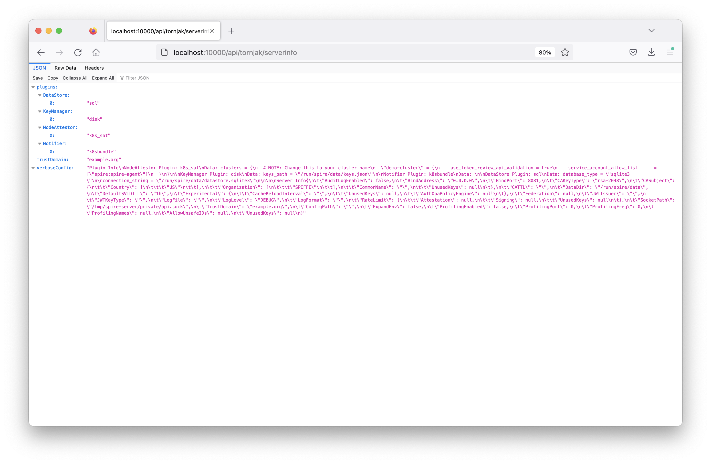

# Tornjak simple deployment with SPIRE k8s quickstart

In this tutorial, we will deploy Tornjak locally via the official SPIRE Helm charts. Then, we will explore both the API and UI of Tornjak. 

Before we dive into the deployment process, let’s familiarize ourselves with Tornjak and SPIRE.

[SPIRE](https://github.com/spiffe/spire) (the SPIFFE Runtime Environment) is an open-source software tool that provides a way to issue and manage identities in the form of SPIFFE IDs within a distributed system. These identities are used to establish trust between software services and are based on the SPIFFE (Secure Production Identity Framework For Everyone) standards, which define a universal identity control plane for distributed systems. SPIRE provides access to the SPIFFE Workload API, which authenticates active software systems and allocates SPIFFE IDs and corresponding SVIDs to them. This process enables mutual trust establishment between two distinct workloads.

Tornjak is a control plane and GUI for SPIRE, aimed at managing SPIRE deployments across multiple clusters. It provides a management plane that simplifies and centralizes the administration of SPIRE, offering an intuitive interface for defining, distributing, and visualizing SPIFFE identities across a heterogeneous environment.

This tutorial will allow you to explore the various features of Tornjak in three simple steps:
1. Initialize your local cluster
2. Clone and install the SPIRE Helm charts
3. Connect to the Tornjak backend via API calls
4. Connect to the Tornjak frontend and explore the UI. 

Contents
- [Step 0: Prerequisite](#step-0-prerequisite)
- [Step 1: Deploy SPIRE and Tornjak](#step-1-deploy-spire-and-tornjak)
- [Step 2: Make Tornjak Backend API Calls](#step-2-make-tornjak-backend-api-calls)
- [Step 3: Explore the Tornjak UI](#step-3-explore-the-tornjak-ui)
- [Step n+1: Cleanup](#step-n+1-cleanup)

## Step 0: Prerequisite

Before you begin this tutorial, make sure you have the following:
- Minikube: Version 1.12.0 or later. [Download Minikube.](https://minikube.sigs.k8s.io/docs/start/)
- Docker: Version 20.10.23 or later. [Install Docker.](https://docs.docker.com/get-docker/)

Note: While we have tested this tutorial with the versions below, newer versions should also work. Ensure you're using the most recent stable releases to avoid compatibility issues.
 - Minikube Version 1.12.0, Version 1.31.2
 - Docker Version 20.10.23, Version 24.0.6

### Set up your local Kubernetes cluster

For this tutorial, we will use minikube. If you have an existing kubernetes cluster, feel free to use that.

```console
minikube start
```

```
😄  minikube v1.12.0 on Darwin 11.2
🎉  minikube 1.18.1 is available! Download it: https://github.com/kubernetes/minikube/releases/tag/v1.18.1
💡  To disable this notice, run: 'minikube config set WantUpdateNotification false'
✨  Automatically selected the docker driver. Other choices: hyperkit, virtualbox
👍  Starting control plane node minikube in cluster minikube
🔥  Creating docker container (CPUs=2, Memory=1989MB) ...
🐳  Preparing Kubernetes v1.18.3 on Docker 19.03.2 ...
🔎  Verifying Kubernetes components...
🌟  Enabled addons: default-storageclass, storage-provisioner
🏄  Done! kubectl is now configured to use "minikube"
```

```console
kubectl get nodes
```

```
NAME       STATUS   ROLES    AGE   VERSION
minikube   Ready    master   79s   v1.18.3
```

[Troubleshoot 1: Minikube fails to start with a Docker CLI context error](#troubleshooting)

## Step 1: Clone and Deploy SPIRE and Tornjak

### Obtaining the Deployment Files

To obtain the relevant files, clone the SPIRE Helm-chart-hardened git repository and cd into the correct directory:

```console
git clone https://github.com/spiffe/helm-charts-hardened.git
```

There are [instructions to deploy Tornjak](https://github.com/spiffe/helm-charts-hardened/tree/main/examples/tornjak#tornjak-with-direct-access) under the Helm charts repository. 

Follow the instructions under the [Tornjak with Direct Access](https://github.com/spiffe/helm-charts-hardened/tree/main/examples/tornjak#tornjak-with-direct-access) section under

Let's verify that the `spire-server-0` pod is now started with the new image:

```console
kubectl -n spire describe pod spire-server-0 | grep "Image:"
```

**or**, on Windows:
```console
kubectl -n spire describe pod spire-server-0 | select-string "Image:"
```

Should yield two lines depending on which deployment you used:

```
    Image:         <SPIRE-IMAGE>
    Image:         <TORNJAK-IMAGE>
```

where `<TORNJAK-IMAGE>` is `ghcr.io/spiffe/tornjak:latest` if you deployed the Tornjak with the UI and is `ghcr.io/spiffe/tornjak-backend:latest` if you deployed only the Tornjak backend.

## Step 3: Configuring Access to Tornjak

### Step 3a: Connecting to the Tornjak backend to make Tornjak API calls

The Tornjak HTTP server is running on port 10000 on the pod. This can easily be accessed by performing a local port forward using `kubectl`. This will cause the local port 10000 to proxy to the Tornjak HTTP server.

```console
kubectl -n spire port-forward spire-server-0 10000:10000
```

You'll see something like this:

```
Forwarding from 127.0.0.1:10000 -> 10000
Forwarding from [::1]:10000 -> 10000
```

While this runs, open a browser to

```
http://localhost:10000/api/tornjak/serverinfo
```

This output represents the backend response. Now you should be able to make Tornjak API calls!



### Step 3b: Connecting to the Tornjak frontend to access the Tornjak UI

Make sure that the backend is accessible from your browser at `http://localhost:10000`, as above, or the frontend will not work.

If you chose to deploy Tornjak with the UI, connecting to the UI is very simple. Otherwise, you can always run the UI locally and connect. See the two choices below:

<details open><summary><b> 🔴 [Click] Run the Tornjak frontend locally</b></summary>

You will need to deploy the separate frontend separately to access the exposed Tornjak backend. We have prebuilt the frontend in a container, so we can simply run it via a single docker command in a separate terminal, which will take a couple minutes to run:

```console
docker run -p 3000:3000 -e REACT_APP_API_SERVER_URI='http://localhost:10000' ghcr.io/spiffe/tornjak-frontend:latest
```

After the image is downloaded, you will eventually see the following output:

```
> tornjak-frontend@0.1.0 start
> react-scripts --openssl-legacy-provider start

ℹ ｢wds｣: Project is running at http://172.17.0.3/
ℹ ｢wds｣: webpack output is served from
ℹ ｢wds｣: Content not from webpack is served from /usr/src/app/public
ℹ ｢wds｣: 404s will fallback to /
Starting the development server...

Compiled successfully!

You can now view tornjak-frontend in the browser.

  Local:            http://localhost:3000
  On Your Network:  http://172.17.0.3:3000

Note that the development build is not optimized.
To create a production build, use npm run build.
```

Note, it will likely take a few minutes for the applicaiton to compile successfully.

</details>

Either of the above steps exposes the frontend at http://localhost:3000.  If you visit in your browser, you should see this page:


## Cleanup

Here are the steps to clean the deployed entities. First, we delete the workload container:

```terminal
kubectl delete deployment client
```

Then, delete the spire agent and server, along with the namespace we created:

```terminal
kubectl delete namespace spire
```

NOTE: You may need to wait a few minutes for the action to complete and the prompt to return

Finally, we can delete the ClusterRole and ClusterRoleBinding:

```terminal
kubectl delete clusterrole spire-server-trust-role spire-agent-cluster-role
kubectl delete clusterrolebinding spire-server-trust-role-binding spire-agent-cluster-role-binding
```

## Troubleshooting
<details><summary><b>Troubleshoot 1: Minikube fails to start with a Docker CLI context error</b></summary>

When running the `minikube start` command, you might encounter an error like the one below:


```console
minikube start
```
```
W1105 15:48:51.730095   42754 main.go:291] Unable to resolve the current Docker CLI context "default": context "default": context not found: open /Users/kidus/.docker/contexts/meta/37a8eec1ce19687d132fe29051dca629d164e2c4958ba141d5f4133a33f0688f/meta.json: no such file or directory
😄  minikube v1.31.2 on Darwin 14.0 (arm64)
✨  Using the docker driver based on existing profile

💣  Exiting due to PROVIDER_DOCKER_NOT_RUNNING: "docker version --format <no value>-<no value>:<no value>" exit status 1: Cannot connect to the Docker daemon at unix:///var/run/docker.sock. Is the docker daemon running?
💡  Suggestion: Start the Docker service
📘  Documentation: https://minikube.sigs.k8s.io/docs/drivers/docker/
```
This typically means that Docker is not running on your machine, and since Minikube is attempting to use Docker as a driver, it's required to have Docker active.
Solution:

1. Check Docker Installation:
-  Make sure Docker is installed on your system. If it's not installed, you can install Docker by following the instructions on the official Docker [installation guide.](https://docs.docker.com/get-docker/)

2. Start Docker:
- On macOS and Windows: Docker Desktop has a graphical interface to manage the Docker service. Open Docker Desktop to start Docker. Alternativly, run the command '''open -a Docker''''
3. Retry Starting Minikube:
- After ensuring that Docker is running, you can start Minikube again using:
```console
minikube start
```
4. Reset Configurations if Needed:
- For Docker context issues:
```console
docker context ls
docker context use default
```
- To reset Minikube:
```console
minikube delete
```
- followed by:
```console
minikube start
```
</details>
