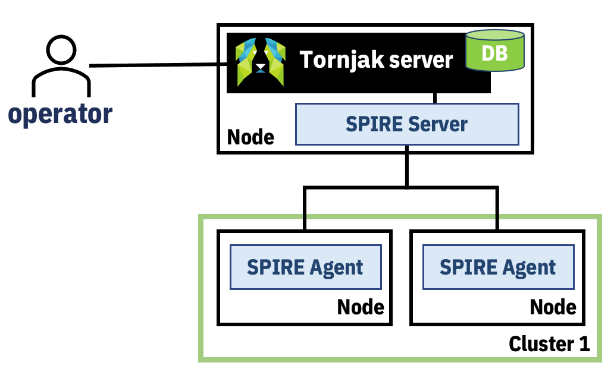

# Tornjak Agent

The components of tornjak on the SPIRE server should ideally be minimal. It should leverage the APIs of the SPIRE server as well as all the controls based around the SPIRE server, this leads to enforcement point being as close to the action as well as not having to have additional management throughout the stack. However, in order to fulfill some of the capabilities that are needed today and current state of features being developed, the component will take up a bigger role. 

As certain new features are built out in SPIRE, these responsibility can then be transfered to use SPIRE native mechanisms. In addition, if certain additional APIs will have a corresponding API in the future, then the capabilities will move to using the SPIRE APIs. 

## Tornjak SPIRE Server Agent
- Provides “proxy” to SPIRE API services
- Provides additional APIs that are useful to management
- Ideally all useful information will be part of the SPIRE API, calling through Tornjak SPIRE backend, but because additional information is required and components are still not yet in place to enable direct pass through for authentication (issue #TBD) and authorization yet (issue #1975)

### APIs:
- SPIRE Specific
  - /api/spire/agent/*
  - /api/spire/entry/*
  - etc.
- Additional APIs
  - /api/getserverinfo
  - /api/getlogs

### Authentication:
- Ideally, authentication should be handled through SPIRE server, today, this is done via the socket or via the "Admin" flag for a SPIFFE ID within the trust domain. There are conversations about this (Issue #TBD) to enable SPIFFE IDs outside the trust domain of the SPIRE server or through other authentication mechanisms to administer the SPIRE server. This is to address the bootstrapping problem of administration of a SPIRE server. 
- In the meantime, the Tornjak agent will use the socket to authenticate with the SPIRE server. This means that additional authentication needs to be done to authenticate the caller (management plane) to the agent. For this, we will implement standard client authentication mechanisms configured on the agent. This will mirror the configuration of our ideal state with a workaround for authentication to be done.

### Authorization
- Ideally, authentication should be handled through SPIRE server mechanisms, with the feature from #1975
- For now, we will have a flat access model, which is equivalent to "Admin" flag of the SPIRE server.
