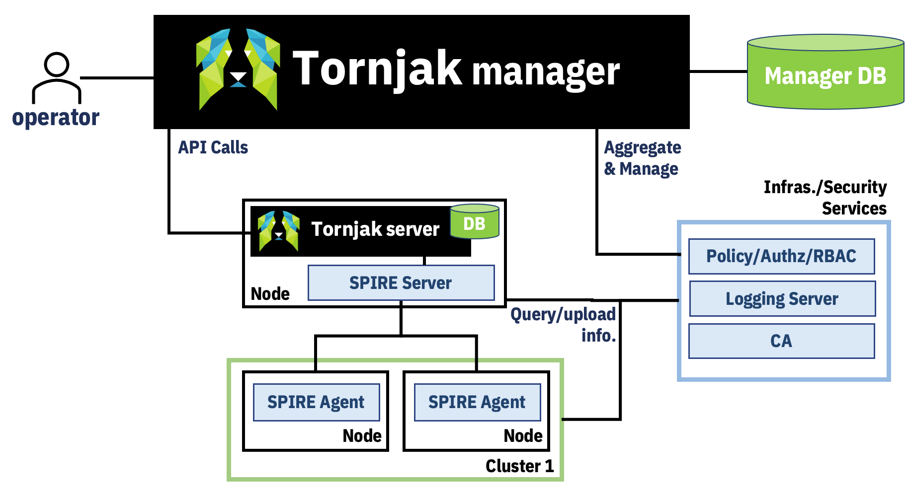

# Tornjak manager 

The tornjak manager provides a way to manage identities, providing capabilities such as:
- Global visibility of identity registrations
- Management of SPIRE identity configurations (Q)
- Identity policy management
- Auditability of identities

The design idea behind the manager is to act as a thin layer between the user and the tornjak agents, and relevant policy/logging components.

## Global visibility

Provide a dashboard of identity information and api calls to various spire servers through the tornjak agent. 

Actions possible:
- Register tornjak agent / spire server
  - Provide address
  - Choose authentication method - User or Certificate [pending auth issue #TBD]
    - Engineering detail, for user, the credentials from the web browser of the user would be used to authenticate, if certificates, certificates will be provided and the backend would be responsible for authentication. i.e. AJAX/axios calls would be "https://adresss/api..." vs "/address/api" for user vs server
  - Server + optional credentials are stored in the manager DB
- SPIRE API actions on servers
  - frontend/backend for all SPIRE API actions 
- Get server information + custom tornjak APIs
  - This will include what are the plugins used in the server and pointing to logging and policy configurations for linking audit info. centrally
  - frontend/backend for all custom tornjak API actions 

## Identity policy management
- Provide an interface to the policy engines used by the SPIRE deployments
- Actions
  - Add policy engine
    - Provide address
    - Choose authentication method - User or Certificate [pending auth issue #TBD]
  - Visibility and consumability of policies
  - Provide templates for more complex policies to be created
  - CRUD on policies

## Auditability of Identities and use for operations/forensics
- Provide a collection of information, including logs, policy and registrations. This will include the statistics of use of SVIDs, minting, etc. 
  - May depend on additional features in SPIRE required
- Provide a way to consume this information or export the feed to another log consuming /metrics frontend.

## Management of SPIRE Identity configurations

Provide the ability to configure identities, including the ability to configure attestation configs, plugins, etc.

Actions possible:
- Ability to set identity related configuration that is not exposed by the SPIRE API today, i.e.:
  - Add a node attestor to a node
  - Set workload registrar configuration
- These set of actions are tricky, which begs the question of whether some of these actions should be exposed via the SPIRE server API. 
  - These configurations are done today on the SPIRE server configuration file. Therefore it requires the management of the deployment in order
    for these configurations to be managed for it. This raises some questions to be discussed about how to manage plugins.
  - It is not straight forward for these to be managed by the tornjak agent because sometimes, these configurations are backed by non-traditional storage.
    i.e. kubernetes configmap. In these cases, in order for the agent to be effective, it needs to be configured with knowledge of how to persist changes.
