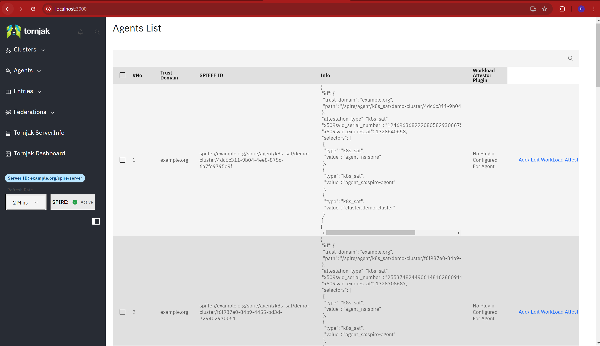

# Tornjak simple deployment with SPIRE k8s quickstart

In this doc, we will show how to configure Tornjak with a SPIRE deployment using the SPIRE k8s quickstart tutorial. As we will see, this is as simple as three steps:
1. setting up 
2. creating a k8s ConfigMap for storing the Tornjak configuration
3. editing the SPIRE server statefulset to use the Tornjak compatible image and pass the ConfigMap as an argument. 

## Step 1: Setup SPIRE k8s quickstart tutorial (optional)

For this tutorial we will utilize the SPIRE k8s quickstart deployment for a SPIRE deployment. If you have a SPIRE deployment set up already, you may skip this step and go ahead to the [section: configuring Tornjak](#step-2-configuring-tornjak). If not we will use the [SPIRE quickstart for Kubernetes](https://spiffe.io/docs/latest/try/getting-started-k8s/).

### Setting up k8s

For this tutorial, we will use minikube, if you have an existing kubernetes cluster, feel free to use that.

```
➜  ~ minikube start
😄  minikube v1.12.0 on Darwin 11.2
🎉  minikube 1.18.1 is available! Download it: https://github.com/kubernetes/minikube/releases/tag/v1.18.1
💡  To disable this notice, run: 'minikube config set WantUpdateNotification false'
✨  Automatically selected the docker driver. Other choices: hyperkit, virtualbox
👍  Starting control plane node minikube in cluster minikube
🔥  Creating docker container (CPUs=2, Memory=1989MB) ...
🐳  Preparing Kubernetes v1.18.3 on Docker 19.03.2 ...
🔎  Verifying Kubernetes components...
🌟  Enabled addons: default-storageclass, storage-provisioner
🏄  Done! kubectl is now configured to use "minikube"

➜  ~ kubectl get nodes
NAME       STATUS   ROLES    AGE   VERSION
minikube   Ready    master   79s   v1.18.3
```


### Setting up the SPIRE deployment

Next, we will follow the steps from the [SPIRE quickstart for Kubernetes](https://spiffe.io/docs/latest/try/getting-started-k8s/), for the most accurate information, follow the instructions from the page to get your SPIRE deployment set up. Follow through with the tutorial till you get to the end, but do not tear down the components! The output would look like the following:

```
➜  ~ git clone git@github.com:spiffe/spire-tutorials.git
Cloning into 'spire-tutorials'...
remote: Enumerating objects: 65, done.
remote: Counting objects: 100% (65/65), done.
remote: Compressing objects: 100% (49/49), done.
remote: Total 725 (delta 20), reused 52 (delta 16), pack-reused 660
Receiving objects: 100% (725/725), 1008.46 KiB | 9.08 MiB/s, done.
Resolving deltas: 100% (327/327), done.

➜  ~ cd spire-tutorials/k8s/quickstart

➜  quickstart git:(master) kubectl apply -f spire-namespace.yaml
namespace/spire created

➜  quickstart git:(master)  kubectl apply \
    -f server-account.yaml \
    -f spire-bundle-configmap.yaml \
    -f server-cluster-role.yaml
serviceaccount/spire-server created
configmap/spire-bundle created
clusterrole.rbac.authorization.k8s.io/spire-server-trust-role created
clusterrolebinding.rbac.authorization.k8s.io/spire-server-trust-role-binding created

➜  quickstart git:(master) kubectl apply \
    -f server-configmap.yaml \
    -f server-statefulset.yaml \
    -f server-service.yaml
configmap/spire-server created
statefulset.apps/spire-server created
service/spire-server created

➜  quickstart git:(master) kubectl get statefulset --namespace spire
NAME           READY   AGE
spire-server   1/1     26s
```

### Deploying the agent and creating test entries

```
➜  quickstart git:(master) kubectl apply \
    -f agent-account.yaml \
    -f agent-cluster-role.yaml
serviceaccount/spire-agent created
clusterrole.rbac.authorization.k8s.io/spire-agent-cluster-role created
clusterrolebinding.rbac.authorization.k8s.io/spire-agent-cluster-role-binding created

➜  quickstart git:(master) kubectl apply \
    -f agent-configmap.yaml \
    -f agent-daemonset.yaml
configmap/spire-agent created
daemonset.apps/spire-agent created

➜  quickstart git:(master) kubectl get daemonset --namespace spire
NAME          DESIRED   CURRENT   READY   UP-TO-DATE   AVAILABLE   NODE SELECTOR   AGE
spire-agent   1         1         1       1            1           <none>          19s

➜  quickstart git:(master) kubectl exec -n spire spire-server-0 -- \
    /opt/spire/bin/spire-server entry create \
    -spiffeID spiffe://example.org/ns/spire/sa/spire-agent \
    -selector k8s_sat:cluster:demo-cluster \
    -selector k8s_sat:agent_ns:spire \
    -selector k8s_sat:agent_sa:spire-agent \
    -node
Entry ID         : 03d0ec2b-54b7-4340-a0b9-d3b2cf1b041a
SPIFFE ID        : spiffe://example.org/ns/spire/sa/spire-agent
Parent ID        : spiffe://example.org/spire/server
Revision         : 0
TTL              : default
Selector         : k8s_sat:agent_ns:spire
Selector         : k8s_sat:agent_sa:spire-agent
Selector         : k8s_sat:cluster:demo-cluster

➜  quickstart git:(master) kubectl exec -n spire spire-server-0 -- \
    /opt/spire/bin/spire-server entry create \
    -spiffeID spiffe://example.org/ns/default/sa/default \
    -parentID spiffe://example.org/ns/spire/sa/spire-agent \
    -selector k8s:ns:default \
    -selector k8s:sa:default
Entry ID         : 11a367ab-7095-4390-ab89-34dea5fddd61
SPIFFE ID        : spiffe://example.org/ns/default/sa/default
Parent ID        : spiffe://example.org/ns/spire/sa/spire-agent
Revision         : 0
TTL              : default
Selector         : k8s:ns:default
Selector         : k8s:sa:default

➜  quickstart git:(master) kubectl apply -f client-deployment.yaml
deployment.apps/client created

➜  quickstart git:(master) kubectl exec -it $(kubectl get pods -o=jsonpath='{.items[0].metadata.name}' \
   -l app=client)  -- /bin/sh
/opt/spire # /opt/spire/bin/spire-agent api fetch -socketPath /run/spire/sockets/agent.sock
Received 1 svid after 8.8537ms

SPIFFE ID:		spiffe://example.org/ns/default/sa/default
SVID Valid After:	2021-04-06 20:13:02 +0000 UTC
SVID Valid Until:	2021-04-06 21:13:12 +0000 UTC
CA #1 Valid After:	2021-04-06 20:12:20 +0000 UTC
CA #1 Valid Until:	2021-04-07 20:12:30 +0000 UTC

/opt/spire #
```


## Step 2: Configuring Tornjak

Now that we have the SPIRE deployment set up, it should be fairly simple to use Tornjak.

### Creating the Tornjak ConfigMap

We first need to create the ConfigMap. We can create a new file: 

```
➜  quickstart git:(master) cat tornjak-configmap.yaml 
apiVersion: v1
kind: ConfigMap
metadata:
  name: tornjak-agent
  namespace: spire
data:
  server.conf: |
    server {
      metadata = "insert metadata"
    }

    plugins {
      DataStore "sql" {
        plugin_data {
          drivername = "sqlite3"
          filename = "./agentlocaldb"
        }
      }

    }
```

### Updating the SPIRE Server statefulset
Next, we need to update the image of the SPIRE server statefulset, as well as make sure we pass in the Tornjak config. 

The statefulset will be different depnding on whether you wish to use the sidecar implementation of Tornjak, where there is a separate container, or the image of the Tornjak backend that contains the SPIRE agent in the same container: 

<details><summary>[Click] For the Tornjak-backend wrapped with the SPIRE server. (WARNING: CURRENTLY UNSUPPORTED)</summary>

The statefulset will look something like this, where we have commented leading with a 👈 on the changed or new lines: 

```
➜  quickstart git:(master) cat server-statefulset.yaml 
apiVersion: apps/v1
kind: StatefulSet
metadata:
  name: spire-server
  namespace: spire
  labels:
    app: spire-server
spec:
  replicas: 1
  selector:
    matchLabels:
      app: spire-server
  serviceName: spire-server
  template:
    metadata:
      namespace: spire
      labels:
        app: spire-server
    spec:
      serviceAccountName: spire-server
      containers:
        - name: spire-server
          image: ghcr.io/spiffe/tornjak-be-spire-server:1.x.x # 👈 NOTE YOUR OWN SPIRE VERSION
          imagePullPolicy: Always
          args:
            - -config
            - /run/spire/config/server.conf
            - -tornjak-config # 👈 ADDITIONAL ARGUMENT
            - /run/spire/tornjak-config/server.conf # 👈 ADDITIONAL ARGUMENT
          ports:
            - containerPort: 8081
          volumeMounts:
            - name: spire-config
              mountPath: /run/spire/config
              readOnly: true
            - name: tornjak-config # 👈 ADDITIONAL VOLUME
              mountPath: /run/spire/tornjak-config # 👈 ADDITIONAL VOLUME
              readOnly: true # 👈 ADDITIONAL VOLUME
            - name: spire-data
              mountPath: /run/spire/data
              readOnly: false
          livenessProbe:
            httpGet:
              path: /live
              port: 8080
            failureThreshold: 2
            initialDelaySeconds: 15
            periodSeconds: 60
            timeoutSeconds: 3
          readinessProbe:
            httpGet:
              path: /ready
              port: 8080
            initialDelaySeconds: 5
            periodSeconds: 5
      volumes:
        - name: spire-config
          configMap:
            name: spire-server
        - name: tornjak-config # 👈 ADDITIONAL VOLUME
          configMap: # 👈 ADDITIONAL VOLUME
            name: tornjak-agent # 👈 ADDITIONAL VOLUME
  volumeClaimTemplates:
    - metadata:
        name: spire-data
        namespace: spire
      spec:
        accessModes:
          - ReadWriteOnce
        resources:
          requests:
            storage: 1Gi
```

Note that there are four key differences in this StatefulSet file from that in the SPIRE quickstart:

1. The image name is changed to this one that contains a SPIRE server and the Tornjak backend. 
2. There is an additional argument for the Tornjak config. 
3. We create a volume named `tornjak-config` that reads from the ConfigMap `tornjak-agent`.
4. We create a volume mount that mounts the `tornjak-config` volume to a path in the container. 

This is all done specifically to pass the Tornjak config file as an argument to the container. 

</details>

<details><summary>[Click] For the Tornjak-backend sidecar implementation</summary>

There is an additional requirement to mount the SPIRE server socket and make it accessible to the Tornjak backend container. 

The statefulset will look something like this, where we have commented leading with a 👈 on the changed or new lines: 

```
➜  quickstart git:(master) cat server-statefulset.yaml 
apiVersion: apps/v1
kind: StatefulSet
metadata:
  name: spire-server
  namespace: spire
  labels:
    app: spire-server
spec:
  replicas: 1
  selector:
    matchLabels:
      app: spire-server
  serviceName: spire-server
  template:
    metadata:
      namespace: spire
      labels:
        app: spire-server
    spec:
      serviceAccountName: spire-server
      containers:
        - name: spire-server
          image: ghcr.io/spiffe/spire-server:1.4.4
          args:
            - -config
            - /run/spire/config/server.conf
          ports:
            - containerPort: 8081
          volumeMounts:
            - name: spire-config
              mountPath: /run/spire/config
              readOnly: true
            - name: spire-data
              mountPath: /run/spire/data
              readOnly: false
            - name: socket # 👈 ADDITIONAL VOLUME
              mountPath: /tmp/spire-server/private # 👈 ADDITIONAL VOLUME
          livenessProbe:
            httpGet:
              path: /live
              port: 8080
            failureThreshold: 2
            initialDelaySeconds: 15
            periodSeconds: 60
            timeoutSeconds: 3
          readinessProbe:
            httpGet:
              path: /ready
              port: 8080
            initialDelaySeconds: 5
            periodSeconds: 5
	### 👈 BEGIN ADDITIONAL CONTAINER ###
        - name: tornjak-backend
          image: ghcr.io/spiffe/tornjak-be:latest
          args:
            - -config
            - /run/spire/config/server.conf
            - -tornjak-config
            - /run/spire/tornjak-config/server.conf
          ports:
            - containerPort: 8081
          volumeMounts:
            - name: spire-config
              mountPath: /run/spire/config
              readOnly: true
            - name: tornjak-config
              mountPath: /run/spire/tornjak-config
              readOnly: true
            - name: spire-data
              mountPath: /run/spire/data
              readOnly: false
            - name: socket
              mountPath: /tmp/spire-server/private
	### 👈 END ADDITIONAL CONTAINER ###
      volumes:
        - name: spire-config
          configMap:
            name: spire-server
        - name: tornjak-config # 👈 ADDITIONAL VOLUME
          configMap: # 👈 ADDITIONAL VOLUME
            name: tornjak-agent # 👈 ADDITIONAL VOLUME
        - name: socket # 👈 ADDITIONAL VOLUME
          emptyDir: {} # 👈 ADDITIONAL VOLUME
  volumeClaimTemplates:
    - metadata:
        name: spire-data
        namespace: spire
      spec:
        accessModes:
          - ReadWriteOnce
        resources:
          requests:
            storage: 1Gi
```

Note that there are three key differences in this StatefulSet file from that in the SPIRE quickstart:

1. There is a new container in the pod named tornjak-backend. 
3. We create a volume named `tornjak-config` that reads from the ConfigMap `tornjak-agent`.
4. We create a volume named `test-socket` so that the containers may communicate. 

This is all done specifically to pass the Tornjak config file as an argument to the container and to allow communication between Tornjak and SPIRE. 

</details>


### Applying and connecting to the Tornjak agent

First, we must add the ConfigMap:

```
➜  quickstart git:(master) ✗ kubectl apply -f tornjak-configmap.yaml
configmap/tornjak-agent created
```

We can then apply the changes of the statefulset deployment:

```
➜  quickstart git:(master) ✗ kubectl apply -f server-statefulset.yaml
statefulset.apps/spire-server configured
➜  quickstart git:(master) ✗ kubectl delete po -n spire spire-server-0
pod "spire-server-0" deleted
```

We will then wait and verify that the `spire-server-0` pod is now started with the new image:

```
➜  quickstart git:(master) ✗ kubectl -n spire describe pod spire-server-0 | grep "Image:"
    Image:         ghcr.io/spiffe/tornjak-be-spire-server:1.x.x
```

## Connecting to the Tornjak agent

The Tornjak HTTP server is running on port 10000 on the port. This can easily be accessed by performing a local port forward using `kubectl`. This will cause the local port 10000 to proxy to the Tornjak HTTP server.

```
➜  quickstart git:(master) ✗ kubectl -n spire port-forward spire-server-0 10000:10000
Forwarding from 127.0.0.1:10000 -> 10000
Forwarding from [::1]:10000 -> 10000
```

Open a browser to `http://localhost:10000` and you should now be able to make Tornjak API calls!


## Connecting the Tornjak UI

Now that we've deployed and exposed the Tornjak backend, it is easy enough to deploy the separate frontend. We have prebuilt the frontend in a container, so we can simply run it via a single docker command, which will take a couple minutes to run: 

```
➜  quickstart git:(master) ✗ docker run -p 3000:3000 -e REACT_APP_API_SERVER_URI='http://localhost:10000' ghcr.io/spiffe/tornjak-fe:latest 

> tornjak-frontend@0.1.0 start
> react-scripts --openssl-legacy-provider start

ℹ ｢wds｣: Project is running at http://172.17.0.3/
ℹ ｢wds｣: webpack output is served from 
ℹ ｢wds｣: Content not from webpack is served from /usr/src/app/public
ℹ ｢wds｣: 404s will fallback to /
Starting the development server...

Compiled successfully!

You can now view tornjak-frontend in the browser.

  Local:            http://localhost:3000
  On Your Network:  http://172.17.0.3:3000

Note that the development build is not optimized.
To create a production build, use npm run build.
```

This exposes the frontend at http://localhost:3000.  If you visit in your browser, you should see this page:



