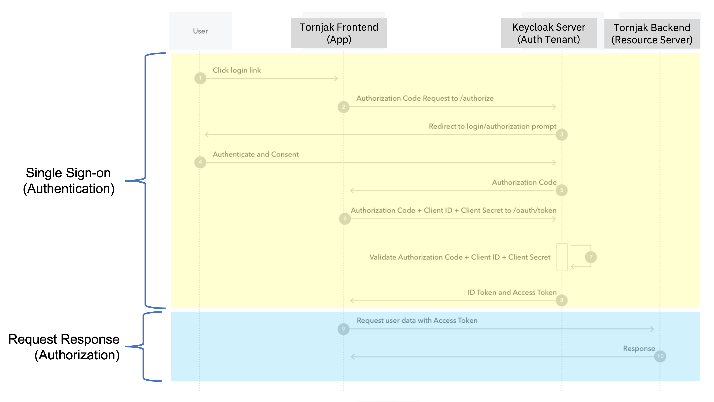
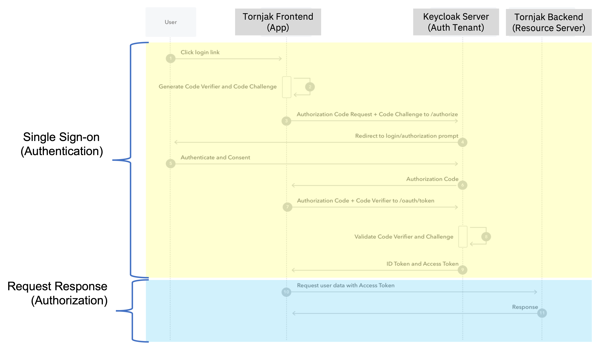

# User Management

This document compiles all the information on the integration of user management with Tornjak.

Currently, user management is available only for a single instance of a Tornjak agent with a Frontend.

## Overview

We follow the OAuth2.0 spec for authentication. The diagrams below show the implemented [Standard Authorization Code Flow](https://auth0.com/docs/get-started/authentication-and-authorization-flow/authorization-code-flow):


We will eventually be implementing the [Authorization Code Flow with PKCE](https://auth0.com/docs/get-started/authentication-and-authorization-flow/authorization-code-flow-with-proof-key-for-code-exchange-pkce) to secure the backend with a public frontend application. This is necessary as the public frontend cannot store client secrets securely:


A more in-depth Medium article for the overall architecture can be found [here](https://medium.com/universal-workload-identity/identity-access-management-iam-integration-with-tornjak-749984966ab5).

## Architecture

[TODO insert architecture diagram here]

The architecture integrates with a separate Auth server. This Auth server is used to secure the backend, which can be configured to expected access tokens signed by a given list of public keys.  Then, any callers to the Auth server must be able to obtain such an access token.  

## General Deployment

User management requires the following:

* There must be an existing, pre-configured Auth Server to integrate with Tornjak (e.g. Keycloak)
* The Tornjak Backend is deployed with a configuration pointing to said Auth Server.
* The Tornjak Frontend must be deployed configured to obtain access tokens from said Auth Server before sending calls to the Tornjak Backend.

## Examples and Tutorials

We have experimented extensively with the open source Keycloak Auth Server.
Specifically, it is very easy to set up a Tornjak secured by Keycloak today, by following these steps:

1.  **Configure Auth Server**
To configure the Auth Server, please see our [Medium blog](https://medium.com/universal-workload-identity/step-by-step-guide-to-setup-keycloak-configuration-for-tornjak-dbe5c3049034) for a walkthrough on configuring the Auth Server. For more in-depth documentation on this setup, please see [this document on Keycloak configuration](./keycloak-configuration.md).

Alternatively, see [our keycloak example](/examples/keycloak) for ready deployment files into your local Kubernetes cluster.

1.  **Enable User Management for Tornjak Backend**
Once the Auth Server is set up, we can deploy the Tornjak Backend to require access tokens from our Auth Server,
as detailed in
[this followup Medium blog](https://medium.com/universal-workload-identity/guide-to-integrating-tornjak-with-keycloak-for-access-control-to-spire-40a3d5ee5f5a),
with more details on the general configuration
[here](/docs/config-tornjak-server.md). Most notably, populate a new plugin section for keycloak as defined [here](/docs/plugins/plugin_server_auth_keycloak.md) like so:

```
...
  Authenticator "Keycloak" {
    plugin_data {
      # issuer - Issuer URL for OIDC
      issuer = "http://host.docker.internal:8080/realms/tornjak"
      audience = "tornjak-backend"
    }
  }

  Authorizer "AdminViewer" {}
...
```

1.  **Configure Tornjak Frontend**
Finally, the Frontend must be deployed and configured to obtain access tokens from this auth server.
This can be done locally with the environment variable
`REACT_APP_AUTH_SERVER_URI`. In addition `REACT_APP_KEYCLOAK_REALM` and `REACT_APP_OIDC_CLIENT_ID` must be set as well.

Default values are:

`REACT_APP_KEYCLOAK_REALM` - 'tornjak'

`REACT_APP_OIDC_CLIENT_ID` - 'tornjak'

```
cd tornjak-frontend
REACT_APP_API_SERVER_URI=http://localhost:10000/
REACT_APP_KEYCLOAK_REALM=tornjak
REACT_APP_OIDC_CLIENT_ID=tornjak
REACT_APP_AUTH_SERVER_URI=http://localhost:8080/ npm start
```

Alternatively, we can do the same on the containerized version:

```
docker run -p 3000:3000 -d -e REACT_APP_API_SERVER_URI='http://localhost:10000' -e REACT_APP_AUTH_SERVER_URI='http://localhost:8080' -e REACT_APP_KEYCLOAK_REALM='tornjak' -e 
REACT_APP_OIDC_CLIENT_ID='tornjak' ghcr.io/spiffe/tornjak-frontend:v1.6.0
`
```

This will start a Tornjak frontend on `http://localhost:3000`
Please be patient, as it might take a few minutes to compile and start the server.

For a cloud deployment change the URLs accordingly using the cloud provider ingress.

Given the Auth Server configuration above, we have an `admin` and a `viewer` user type.
An Admin User has an admin level privileges allowing create, configure, and delete operations.
The Viewer User has a restricted access for the Tornjak UI, allowing only read and list operations.  
